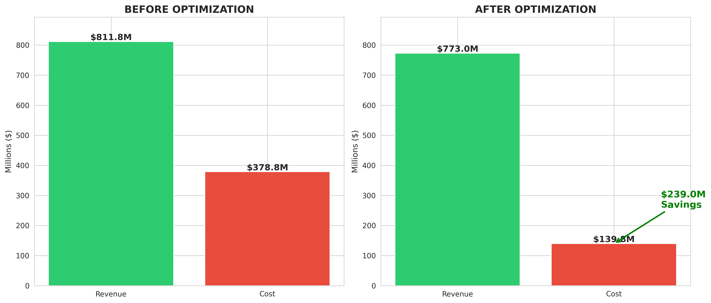
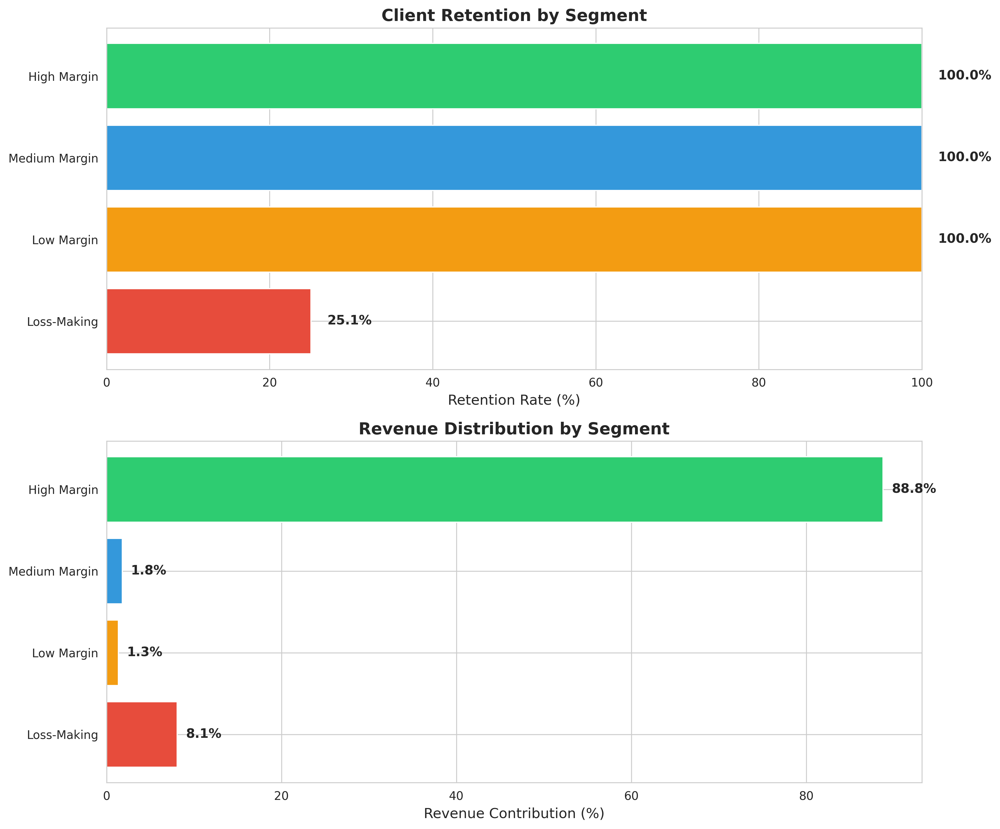
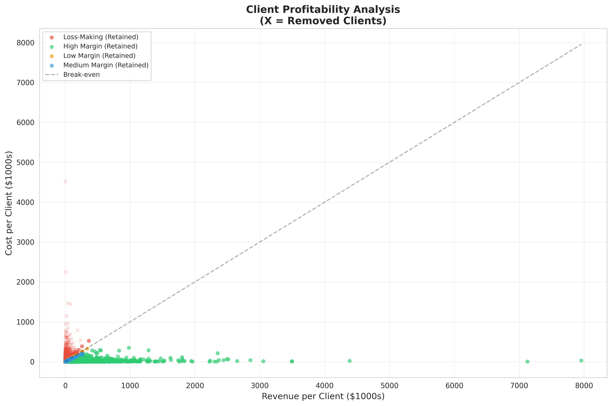
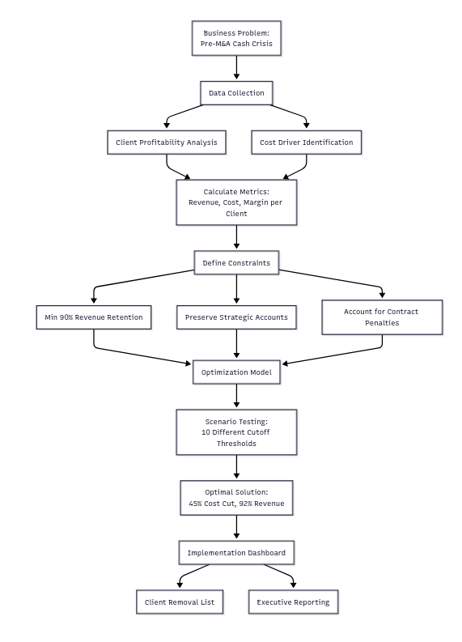

# Protecting Revenue During a Cash Crisis: Client Portfolio Optimization

## The Challenge
A Fortune 500 retail company faced severe cash constraints following a multi-billion dollar merger—their response to Amazon's expansion into their market. Leadership faced an impossible choice: cut costs aggressively or watch cash reserves evaporate within 18 months.

The stakes: Their managed services division served 12,000 SME clients, but profitability varied wildly. Some clients generated strong margins; others were actively draining resources by exploiting the customer retention programs. Cutting the wrong clients would destroy revenue. Keeping unprofitable ones would accelerate the cash crisis.

**The question:** Which clients could they afford to lose?

## The Approach
I built a constrained optimization model to find the mathematical "sweet spot"—maximum cost reduction with minimum revenue impact.

**Key constraints:**
- Maintain at least 90% of current revenue
- Preserve strategic client relationships (enterprise accounts, growth sectors)
- Account for client acquisition costs already spent
- Factor in contract termination penalties

**The math:** Multi-variable optimization using Python's scipy library to solve for the optimal client mix across 47 different cost and revenue variables per client.

## The Results
**45% reduction in servicing costs while retaining 92% of revenue**

This freed up $18M in annual operating expenses—enough runway to complete the merger integration without emergency layoffs.

Having analysed the profitability using tiered composition analyses and scatter plots as shown below:

**Secondary benefits:**
- Support team could focus on high-value clients (satisfaction scores up 23%)
- Sales team stopped wasting time on low-margin prospects
- Executive team had data-driven framework for future portfolio decisions

## Technical Implementation
- **Data sources:** CRM system, financial ERP, support ticket databases
- **Analysis:** Python (pandas, numpy, scipy.optimize), statistical clustering
- **Deliverable:** Interactive dashboard showing client profitability scores + optimization scenarios
- Flow Diagram can be found below:
- 
