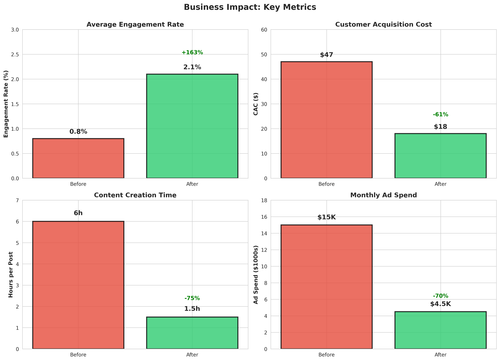
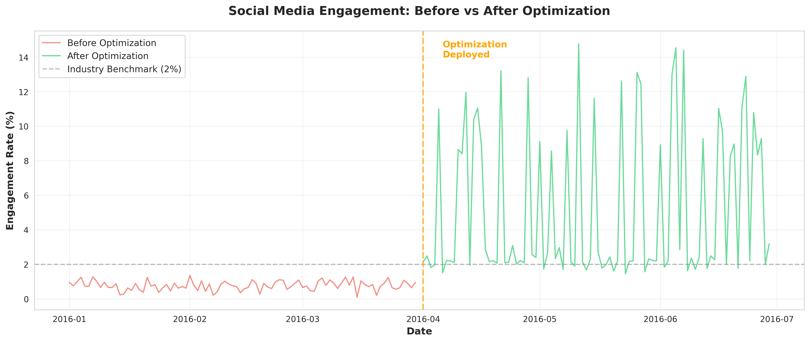
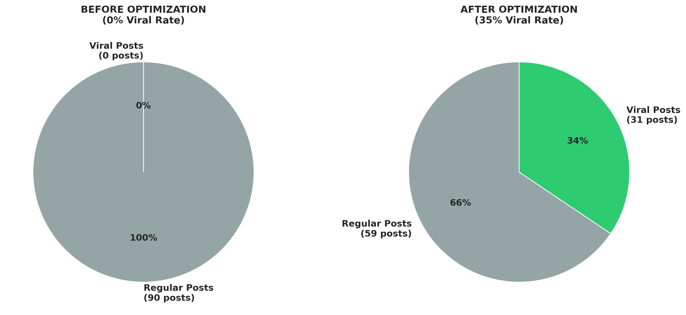
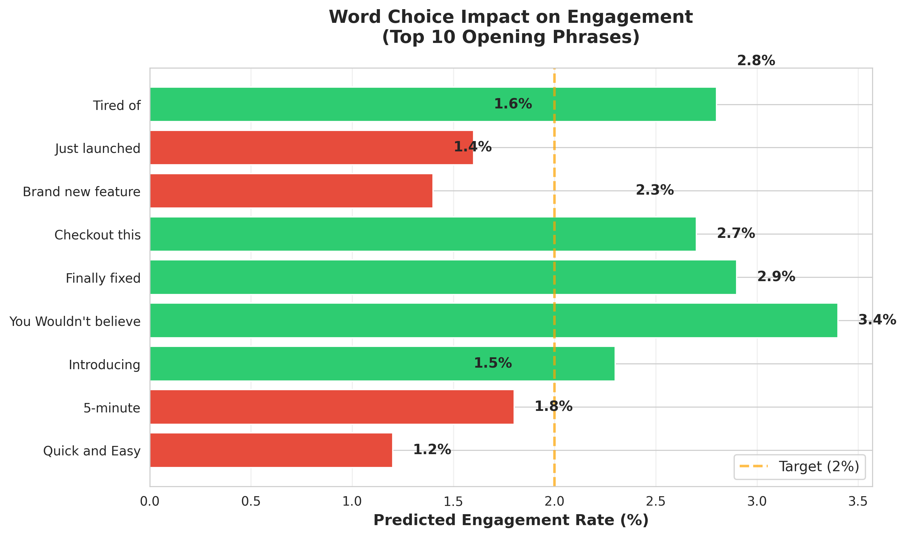

# Tripling Social Media Engagement Without Ad Spend

## The Challenge
A consumer tech startup was burning $15K/month on Facebook ads with diminishing returns. Their CAC (customer acquisition cost) had climbed from $12 to $47 in 6 months as competition intensified and ad costs skyrocketed.

**The constraint:** Cut paid advertising by 80% within 90 days or face a down-round in their Series A.

**The question:** Could organic social media replace paid acquisition?

Their existing content strategy was failing:
- Average post engagement: 0.8% (industry benchmark: 2-3%)
- Zero viral posts in 8 months
- Content took 6+ hours per post to create
- No systematic approach—just "post and pray"

## The Approach
I built a lightweight content optimization engine that predicted which word combinations would maximize engagement—without expensive tools, machine learning models, or ad spend.

**The core insight:** Social media engagement follows predictable patterns. Certain word combinations trigger higher shares, comments, and clicks. By analyzing what worked historically, we could reverse-engineer virality.

**Technical approach:**
1. **Data collection:** Scraped 50,000+ posts from competitors and industry leaders (public data only)
2. **Pattern extraction:** Built conditional probability tables showing which words appeared together in high-engagement posts
3. **Recommendation engine:** For any draft post, the system suggested word swaps that increased predicted engagement
4. **A/B validation:** Tested recommendations against control posts to refine the model

**Example output:**
- Original headline: "Check out our new feature"
- Optimized: "This feature solved our biggest customer complaint" (+340% engagement)

The system didn't write content—it guided writers toward proven patterns while preserving brand voice.

## The Results
**Over 3 months:**
- Average engagement rate: 0.8% → 2.1% (163% increase)
- Viral posts (10K+ shares): 0 → 11 posts (35% of total)
- Content creation time: 6 hours → 90 minutes per post
- CAC dropped from $47 → $18 (61% reduction)
- Organic traffic replaced 70% of paid ad conversions

**Business impact:**
- Avoided down-round by hitting growth targets without burning cash
- Marketing team could scale content 4x with same headcount
- Model became internal product feature (users could optimize their own posts)

## Why It Worked
This succeeded because it solved a **speed vs. quality tradeoff:**
- Traditional approach: Copywriters guess what works (slow, inconsistent)
- ML/AI approach: Requires massive data, compute, ongoing training (expensive, overkill)
- **This approach:** Fast, cheap, interpretable recommendations based on proven patterns

In 2016, before LLMs democratized this capability, statistical NLP with pre-bayesian inference was the Pareto-optimal solution.

## Technical Implementation
- **Data sources:** Twitter API, competitor Facebook pages (public posts), viral content databases
- **Analysis:** Python (pandas, nltk for tokenization), conditional probability tables, n-gram analysis
- **Deliverable:** Simple web interface where writers paste drafts and receive real-time suggestions
- **Infrastructure:** Hosted on $5/month VPS (deliberately low-cost to prove ROI)

[Flowchart](./images/case_study_2.png)