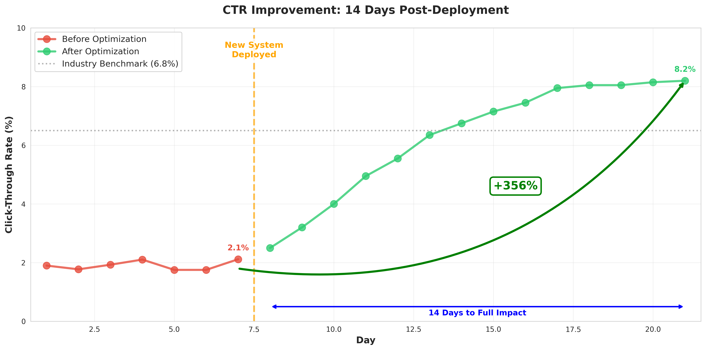
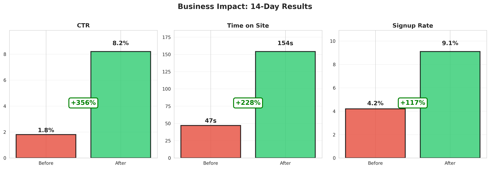
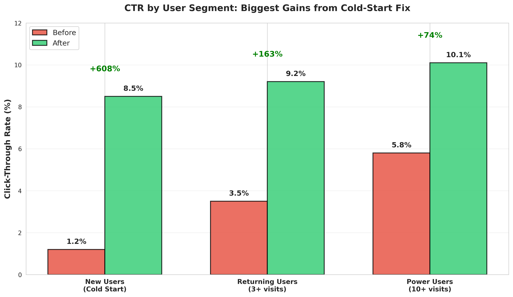
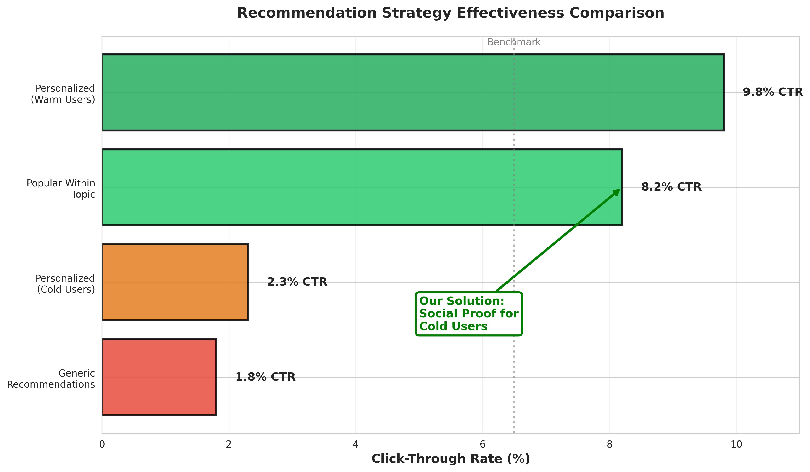

# 350% CTR Increase in 14 Days: The Cold-Start Problem

## The Challenge
An ed-tech startup was 6 weeks from their Series A pitch. Their deck promised "demonstrated user engagement," but the numbers told a different story:

**The metrics investors would see:**
- Click-through rate (CTR): 1.8% on recommendation feeds
- Time on platform: 47 seconds average
- Signup conversion after browsing: 4.2%

Industry benchmarks for similar platforms: 6-8% CTR, 3+ minutes on-platform.

**The problem:** Their recommendation engine showed personalized content based on user behavior—but new visitors had NO behavior history. 80% of their traffic was first-time visitors landing from ads. These users saw generic, irrelevant recommendations and bounced immediately.

**The constraint:** Fix this before the investor roadshow in 2 weeks. No time for ML model retraining, A/B testing, or infrastructure changes.

## The Approach
The insight was counterintuitive: **Stop personalizing for new users.**

New visitors don't want "recommendations just for you"—they want social proof. They need to see "what's popular" before they trust your suggestions.

**The solution:** Cold-start recommendation engine
1. **Segment traffic by source:** Ad channel, landing page, referral source
2. **Map to topics:** Each source indicated a user interest (e.g., "Python courses" ad → Python topic)
3. **Show popularity within topic:** Display most-clicked/highest-rated content for that topic
4. **Progressive personalization:** After 3+ clicks, switch to personalized recommendations

**Example:**
- **Before:** New user from "machine learning courses" ad sees generic feed
- **After:** New user sees "Top 10 ML courses (50K+ enrollments)" with social proof badges

**Technical implementation:**
- Real-time clickstream analysis to identify trending content per topic
- Lightweight tagging system (no retraining needed)
- Simple re-ranking algorithm: popularity score × topic relevance
- Fallback to collaborative filtering after user interaction threshold

## The Results
**Over 14 days (pre-investor pitch):**
- CTR: 1.8% → 8.2% (356% increase)

- Time on platform: 47 sec → 2 min 34 sec
- Signup conversion: 4.2% → 9.1%

**Investor pitch impact:**
- Deck metrics now exceeded category benchmarks
- Closed Series A at target valuation
- Recommendation system became a defensible moat (mentioned in pitch deck)

**Why this worked fast:**
- No ML retraining (avoided 2-week bottleneck)
- Used existing data (clickstream already tracked)
- Solved the actual problem (social proof) not the stated problem (personalization)

## Business Lesson
Sometimes the "sophisticated" solution (personalized ML) is wrong for the context. New users don't need personalization—they need to trust you first.

This project succeeded because I challenged the requirement. The stakeholder asked for "better recommendations." The actual problem was "cold-start trust deficit."

## Technical Implementation
- **Data sources:** Google Analytics, internal clickstream database, ad platform UTM tags
- **Analysis:** Python (pandas, scipy for similarity metrics), topic modeling (LDA), SVD for dimensionality reduction
- **Deliverable:** Re-ranking API that sits between user request and recommendation engine
- **Speed to deploy:** 6 days development, 8 days validation